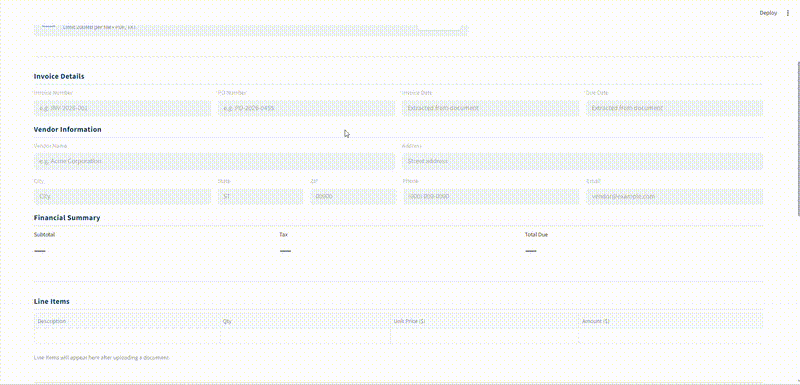

# Parsely

An end-to-end data engineering pipeline that parses invoice documents (PDF and text), extracts structured data, validates it, loads it into Snowflake, and auto-fills a web form with document insights.



---

## What It Does

1. **Upload** a PDF or text invoice via the Streamlit web app
2. **Extract** structured fields automatically — vendor, dates, line items, totals
3. **Review** the auto-filled form — edit any field if needed
4. **Validate** data quality against 10+ business rules
5. **Load** through a medallion architecture (Bronze → Silver → Gold) in Snowflake
6. **Transform** with dbt into a star schema (dimensions + facts)
7. **View** document insights and recent submission history

## Architecture

```
  Upload (Streamlit)
       │
       ▼
  Parse & Extract (Python, pdfplumber, regex)
       │
       ▼
  Validate (10 business rules, confidence scoring)
       │
       ▼
  Bronze → Silver → Gold (Snowflake)
       │                     │
       ▼                     ▼
  dbt Transform (8 models)   Streamlit Web App
  staging → intermediate     (Auto-fill Form + Insights)
       → marts (star schema)
```

## Tech Stack

| Layer | Tools |
|-------|-------|
| Parsing | Python, pdfplumber |
| Extraction | regex, Pydantic schemas |
| Warehouse | Snowflake — Bronze, Silver, and Gold layers |
| Transformations | dbt (8 SQL models + 32 data tests) |
| Data Quality | Custom validation framework, dbt tests |
| Frontend | Streamlit |
| CI/CD | GitHub Actions (lint + test on 3 Python versions) |

## Quick Start

```bash
# Clone and install
git clone https://github.com/divyayechuri/parsely.git
cd parsely
pip install -r requirements.txt

# Run the web app
streamlit run src/app/streamlit_app.py
```

## Run Tests

```bash
pytest tests/ -v            # 90 unit & integration tests
pytest tests/ -v --cov=src  # With coverage
```

## Project Structure

```
parsely/
├── src/
│   ├── ingestion/       # PDF parsing (pdfplumber)
│   ├── extraction/      # Field extraction (regex)
│   ├── validation/      # Data quality rules (10 business rules)
│   ├── loading/         # Snowflake loader (Bronze, Silver, Gold)
│   ├── summarization/   # Document insights generation
│   └── app/             # Streamlit web application
├── dbt/models/
│   ├── staging/         # Clean interface over Silver layer
│   ├── intermediate/    # Business logic & vendor deduplication
│   └── marts/           # Star schema (dim + fact tables)
├── snowflake/ddl/       # Database setup scripts
├── tests/               # 90 unit & integration tests
└── data/samples/        # Sample invoices (PDF + text)
```

## Roadmap

**V1 (current)** — PDF invoice parsing, field extraction, Snowflake integration (Bronze/Silver/Gold), dbt models, Streamlit auto-fill form with edit tracking and insights, CI/CD

**V2** — LLM-powered summarization (Claude API), DOCX & OCR support, multiple document types, data lineage visualization, Terraform IaC, Airflow orchestration, Docker containerization

## License

MIT License. See [LICENSE](LICENSE) for details.
